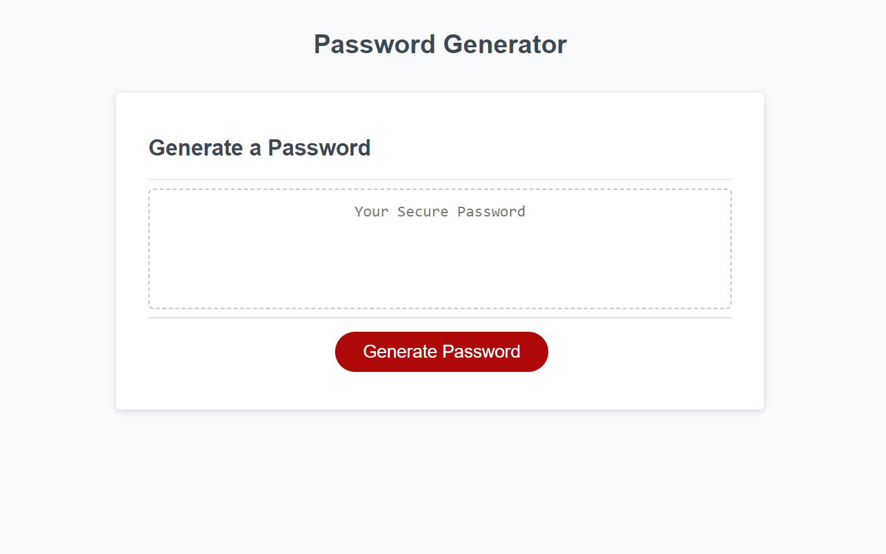

# 03 JavaScript: Password Generator

## Project Description:

This project is for randomly generating a password from scratch. You can optionally add "special characters, undercase, uppercase and numeric' characters to your password.

## Navigation

To do this, simply answer the questions that appear above when you open the page. Then just press the "genarate password" button. The characters that appear are your new password.

Here is a screeshot of Web-Page:

Here is the link of Web-Page: https://mramazant.github.io/Password-Generator/
